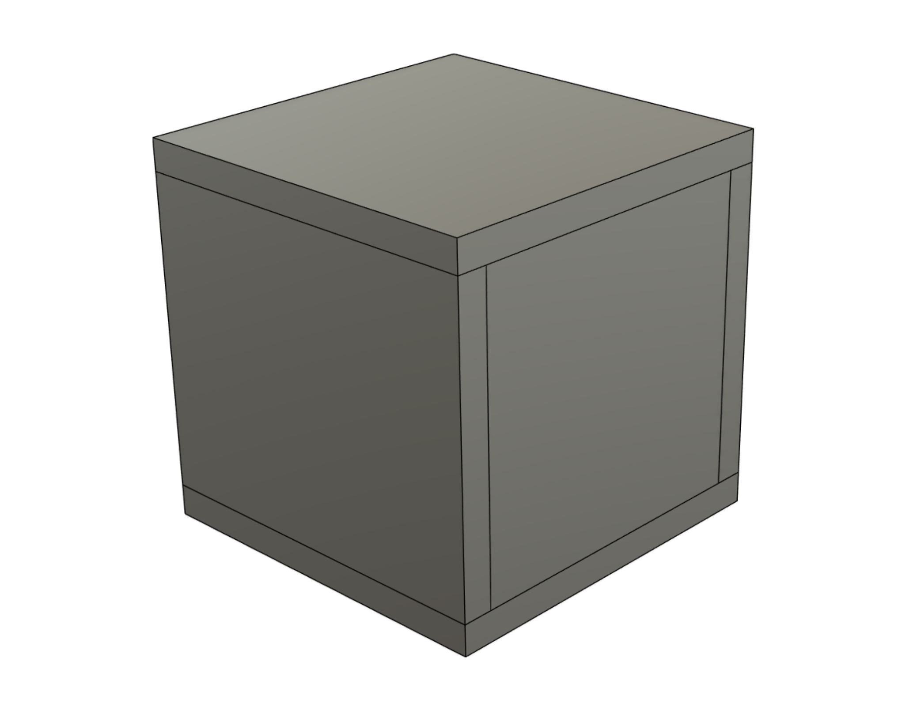
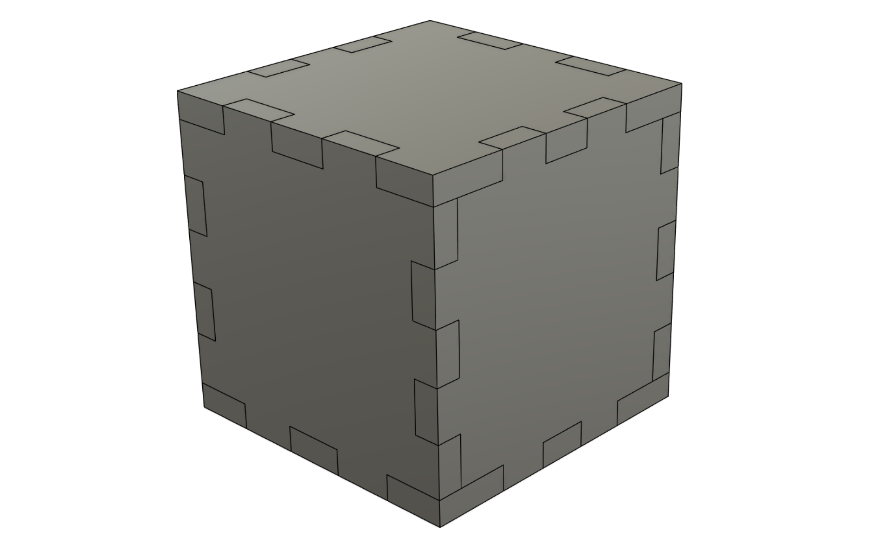

AutoMortise
===

Automatically generate mortise & tenon / box joints between bodies.

The script does approximately the following:
- Finds all face matings between the selected bodies
- Detects which face should have mortises added (the smaller face), and which should have tenons cut
- Accounts for rotation, and bails of the face is not rectangular or contained within the larger face
- Generates a profile on that face in the shape of mortises
- Figures out the depth to cut the tenons
- Performs the extrudes and cuts

The following is on the TODO list:
- Allow mortise to have a configurable min/max width, offset from sides, etc (easy)
- Show a preview of the cuts / extrudes to be made (harder)
- Make some better looking icons for the addin (hardest)

Here's some screenshots of the addin on action:

